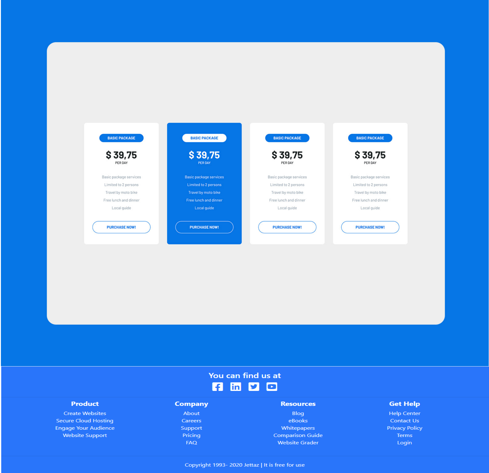

# Basic Package

_35 group website project_

This project is for **educational** purposes only. Pull request are welcome, but priority for project authors! Thank you for your cooperation!

Site published at: https://kristle22.github.io/basic-package-project/

Design: )

## Project features

-   Github pages (multi-page)
-   CSS background-colors
-   CSS floats   

## Authors

Kristina: [Github](https://github.com/Kristle22)